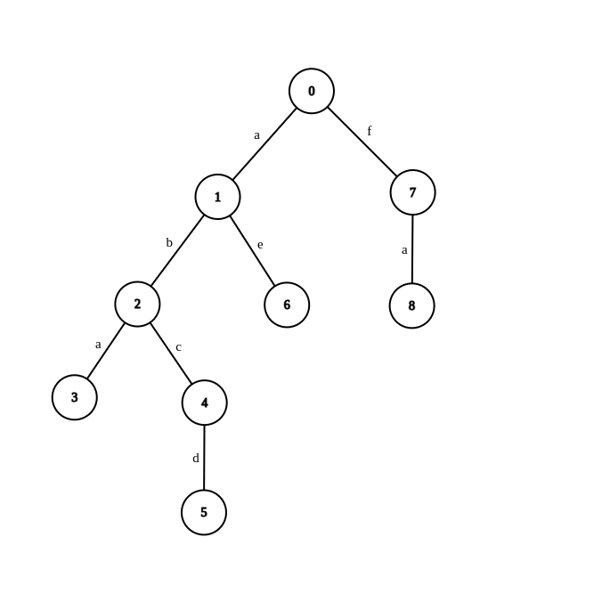

Do rozwiązania zadania pomocne może okazać się drzewo Trie.

### Drzewo Trie -- idea
Będziemy konstruować drzewo. Każdy wierzchołek odpowiada pewnemu słowu (lub jego prefiksowi).
Jeżeli słowo kończy się w danym wierzchołku, to chcemy to w nim pamiętać.
Krawędzie natomiast odpowiadają literom w słowie.

Korzeń drzewa to słowo puste. Bezpośredni sąsiedzi korzenia to słowa długości $1$.
Kolejni to słowa długości $2$, itd.

Idąc krawędzią, do słowa "dodajemy" literkę powiązaną z przechodzoną krawędzią.

Przykładowe drzewo dla słów {`ab`, `aba`, `abcd`, `ae`, `fa`}, może wyglądać następująco:


Wierzchołki $2$, $3$, $5$, $6$ oraz $8$ powinny pamiętać, że w nich kończą się słowa.

### Rozwiązanie wzorcowe
Tworzymy drzewo Trie na bazie słów ze słownika. Odpowiadanie na zapytanie,
to odpowiednie zejście w dół drzewa.

Dla danego zapytania, najpierw schodzimy zgodnie z literami zapytania.
Jeżeli w pewnym momencie chcemy zejść w dół odpowiednią literą,
ale nie ma krawędzi dla tej litery, to znaczy, że nie ma żadnego słowa,
które zaczyna się danym zapytaniem -- wypisujemy `Pomidor`.

W przeciwnym wypadku, jeżeli dojdziemy do końca słowa, to dalej schodzimy w dół,
zawsze wybierając najwcześniejszą (tzn. o najwcześniejszej alfabetycznie literze)
krawędź aż nie dojdziemy do wierzchołka, w którym kończy się jakieś słowo.

Dodawanie słowa o długości $m$ do drzewa Trie ma złożoność $O(m\cdot \alpha)$, gdzie $\alpha$ to rozmiar alfabetu.
Znalezienie pasującego do zapytania słowa ma złożoność $O(M\cdot \alpha)$, gdzie $M$ to długość znalezionego słowa.

## Przykładowe implementacje

### C++

```cpp
#include <bits/stdc++.h>
using namespace std;

struct Trie {
    Trie *next[26];
    bool is_end;

    Trie() : is_end(false) {
        for (int i = 0; i < 26; ++i)
            next[i] = nullptr;
    }

    void add_word(string &s) {
        if (s.empty()) {
            is_end = true;
            return;
        }
        int i = s.back() - 'a';
        if (!next[i])
            next[i] = new trie();
        s.pop_back();
        next[i]->add_word(s);
    }

    string find(string s) {
        int i;
        if (s.empty()) {
            if (is_end)
                return "";
            i = 0;
            while (!next[i]) ++i;
        } else {
            i = s.back() - 'a';
            s.pop_back();
        }
        if (i >= 26 || !next[i])
            return "#";
        return char('a' + i) + next[i]->find(s); 
    }
};

int main() {
    ios_base::sync_with_stdio(false);
    cin.tie(nullptr);

    int n;
    cin >> n;
    Trie R;
    for (int i = 0; i < n; ++i) {
        string s;
        cin >> s;
        reverse(s.begin(), s.end());
        R.add_word(s);
    }
    int q;
    cin >> q;
    for (int i = 0; i < q; ++i) {
        string s;
        cin >> s;
        reverse(s.begin(), s.end());
        string res = R.find(s);
        if (res.back() == '#')
            res = "Pomidor";
        cout << res << '\n';
    }
    return 0;
}
```

### Python

```py
class TrieNode:
    def __init__(self):
        self.is_end = False
        self.next = {}

class Trie:
    def __init__(self):
        self.root = TrieNode()

    def add_word(self, s):
        v = self.root
        for char in s:
            if not char in v.next:
                v.next[char] = TrieNode()
            v = v.next[char]

        v.is_end = True

    def find(self, s):
        v = self.root
        for char in s:
            if not char in v.next:
                return "Pomidor"
            v = v.next[char]

        res = s
        while not v.is_end:
            char = min(v.next.keys())
            v = v.next[char]
            res += char

        return res

def main():
    n = int(input())
    t = Trie()
    for _ in range(n):
        t.add_word(input())
    q = int(input())
    for _ in range(q):
        print(t.find(input()))

main()
```

## Uwagi

- Co prawda, test przykładowy w treści miał posortowane słowa ze słownika,
jednak nigdzie w treści nie było powiedziane, że słowa na wejściu są jakkolwiek uporządkowane.
Pamiętajmy, by **nie zakładać** rzeczy, których nie ma w treści.
