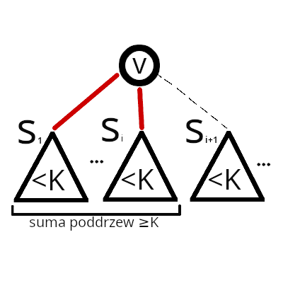
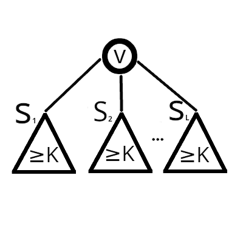

Opiszmy zadanie w terminologii grafowej. Dane jest drzewo ukorzenione w wierzchołku $1$ oraz liczba $K$. Każdy wierzchołek $v$ ma przypisaną wartość $a[v]$. Podzbiór $W$ wierzchołków drzewa nazwiemy **poprawnym**, gdy:

- **Dla każdej pary $(a, b), [ a \neq b ]$ wierzchołków ze zbioru $W$, $a$ nie jest przodkiem $b$.**

- **$ \lvert W \rvert = K$**

Celem zadania jest stwierdzenie, że nie istnieje żaden **poprawny** zbiór, albo w przeciwnym wypadku policzenie wartości:

$max_{\text{ poprawny zbiór W  }} $ $(\sum_{v \in W} a[v])$

Rozwiążemy to zadanie z użyciem programowania dynamicznego. Niech $dp[v][k]$ oznacza optymalny wynik w poddrzewie wierzchołka $v$, zakładając że wybraliśmy do zbioru $W$ dokładnie $k$ wierzchołków.

Przy tak zdefiniowanej tablicy $dp$, wynikiem zadania jest oczywiście $dp[1][K]$. Aby obliczyć wartość $dp[v]$, policzymy najpierw pomocniczą tablicę $bez\_v$. Dla danego $k$, $bez\_v[k]$ będzie oznaczało maksymalną sumę poprawnego zbioru, składającego się z dokładnie $k$ wierzchołków, nie uwzględniając przy tym istnienia wierzchołka $v$. Początkowo $bez\_v[0] = 0$, a pozostałe stany są nieosiągalne. Aby wyliczyć $bez\_v$, przejdziemy po synach $v$ $(s_1, s_2, s_3, \cdots)$ i dla każdego z nich ($s_i$) wykonamy operację *"dołączenia"* wyników z poddrzewa syna $s_i$ do wyników dotychczas złączonych poddrzew synów $s_1, s_2, \cdots, s_{i-1}$:

- dla każdego $1 \leq k \leq K$:
  - $bez\_v'[k] = max_{s, 0 \leq l \leq k}(bez\_v[v][k - l] + dp[s_i][l])$

- $bez\_v = bez\_v'$

W ten sposób \"*dołączamy*\" wyniki z poddrzew kolejnych synów do rozwiązania. W takim razie $dp[v]$ jest *"prawie równe"* $bez\_v$. Musimy rozpatrzeć jednak jeszcze sytuację, w której optymalne jest wybranie wierzchołka $v$. Otrzymujemy więc:

$dp[v][1] = max(bez\_v[1], a[v])$

$dp[v][k > 1] = max(bez\_v[k])$

Przy kalkulacjach należy pamiętać o tym, by rozpatrywać stany *\"nieosiągalne\"* w odpowiedni sposób. Dobrym pomysłem jest np. oznaczenie ich liczbą ujemną. Dzięki temu będą neutralne dla operacji $max$, a po dodaniu dwóch takich stanów, również uzyskamy liczbę ujemną.

Takie rozwiązanie działa w złożoności $O(n \cdot K^2)$. Zależnie od implementacji otrzymuje od `60` do... `100` punktów!

$\huge{\text{Jak to?! }}$ Brut może działać na `100` punktów???
Podejrzewam, że niejeden uczestnik sam nieźle się zdziwił, wysyłając **ewidentnie** wolne rozwiązanie, które uzyskało `100` punktów (:

Otóż, okazuje się, że możemy (nawet przypadkiem, *\"żyłując\"* naszego bruta) natrafić w tym zadaniu na nieoczywisty przykład złożoności zamortyzowanej. Oznaczmy przez $t(v)$ rozmiar całego poddrzewa $v$. Przez $t_i(v)$ oznaczmy natomiast sumę rozmiarów poddrzew pierwszych $i$ synów $v$. Wprowadzimy do naszego algorytmu drobną modyfikację - *"dołączając*" $i$-tego syna przestaniemy wyliczać $bez\_v[k]$ dla $k > t_i(v)$. Ponadto będziemy utrzymywali $dp[v][k]$, wyłącznie dla $k \leq t(v)$. Taka zmiana w oczywisty sposób nie wpływa na poprawność działania algorytmu - usuwamy jedynie zbędne iteracje pętli, przechodzące po nieosiągalnych stanach. Dostajemy więc zmodyfikowany algorytm *"dołączania"* poddrzewa $s_1$:

- dla każdego $k \leq min(t_i(v), K)$:
  - $bez\_v'[k] = max_{s, 0 \leq l \leq min(t(s_i), k)}(bez\_v[v][k - l] + dp[s_i][l])$

- $bez\_v = bez\_v'$

Okazuje się, że taka optymalizacja daje nam znacznie więcej niż zwyczajne *\"zbicie stałej\"* - wpływa ona istotnie na złożoność obliczeniową naszego algorytmu i pozwala cieszyć się maksymalną liczbą punktów za zadanie. Co bardziej wytrwałych czytelników zachęcam do lektury mojej analizy złożoności takiego algorytmu (zamieszczona poniżej), bądź do samodzielnej próby jej przeprowadzenia (zdecydowanie rozwijające zadanie).

## Analiza złożoności

---

    Uwaga techniczna

Notacja $O(f(n))$ **oznacza** w uproszczeniu:
  
*"nie gorzej niż $C \cdot f(n)$ dla pewnej stałej $C$."*

**Nie oznacza** natomiast:

*"przynajmniej $f(n)$*".

Wniosek z powyższego - prawdziwość stwierdzenia np. *"algortm działa w złożoności $O(n^2)$"* nie wyklucza prawdziwości stwierdzenia *"algorytm działa w złożoności $O(n)$*".

---

    Analiza złożoności (zarys)

Podzielimy nasz algorytm na *fazy* - będziemy *"szli"* od liści drzewa. Rozpatrzymy trzy *fazy*:
  1. *wszystkie "dołączenia" zachodzą między poddrzewami o rozmiarach $r1, r2 < K$*.
  2. *wszystkie "dołączenia" zachodzą między poddrzewami o rozmiarach $r1 < K, r2 \geq K$*.
  3. *wszystkie "dołączenia" zachodzą między poddrzewami o rozmiarach $r1 \geq K, r2 \geq K$*.

Wykażemy, iż każdą z tych faz możemy ograniczyć od góry tą samą złożonością $O(f(n, k))$. Ponieważ te trzy fazy pokrywają wszystkie przypadki, więc całkowita złożoność algprytmu również będzie $O(f(n, k))$.

    Analiza złożoności

<ins>Lemat 1</ins>: W całym poddrzewie wierzchołka $v$, wykonamy  sumarycznie $O(t(v)^2)$ operacji.

<ins>Dowód</ins>: rozważmy wierzchołek $v$. Będziemy *"dołączali"* kolejnych synów. *"Dołączając"* kolejnego syna, rozpatrujemy co najwyżej wszystkie pary wyników z *"dołączanego"* poddrzewa z wynikami z już przedtem *"dołączonych"* synów. Rozpatrujemy więc jedynie pary rozmiarów z poddrzew **różnych** synów. Liczba par takich rozmiarów jest nie większa niż liczba par wierzchołków w danych poddrzewach (bo liczba wierzchołków w poddrzewie jest oczywiście równa rozmiarowi poddrzewa). Zauważmy, że mowa tu o parach $(a, b)$ wierzchołków, dla których $v$ to $lca$ (bo znajdują się w poddrzewach różnych synów). Ponieważ dla każdej pary wierzchołków w drzewie istnieje dokładnie jedno $lca(a, b)$, więc w takim razie wykonujemy sumarycznie $O(t(v)^2)$ (liczba par wierzchołków) operacji w całym poddrzewie $v$ (w ogólności w dowolnym drzewie wielkości $n$, wykonamy $O(n^2)$ operacji). $\blacksquare$

---

---

Powiemy, że wierzchołek jest **oznaczony**, gdy $t(v) \geq K$ oraz dla każdego jego potomka $x$, $t(x) < K$. Jeżeli $t(v) = K$, to oczywiście, na mocy <ins>lematu 1</ins> wykonaliśmy w poddrzewie $v$ sumarycznie nie więcej niż $O(K^2)$ operacji. Jeżeli natomiast $t(v) > K$, to istnieje takie $i$, że $t_i(v) \geq K$. Weźmy pierwsze takie $i$. Ponieważ dla każdego syna $s_i$ zachodzi $t(s_i) < K$, więc $t_i(v) < s_{i-1}(v) + k$. Ponieważ, wzięliśmy pierwsze takie $i$, więc w takim razie $t_i(v) < 2 \cdot K$. W takim razie sumaryczna liczba operacji w poddrzewach wierzchołków $s_1, s_2, \cdots, s_i$, na mocy <ins>lematu 1</ins> nie przekroczyła $O(K^2)$.

---

Wiemy, że gdy dla każdego wierzchołka **oznaczonego** wykonamy $O(K^2)$ operacji (wyżej opisana sytuacja), wyeliminujemy sytuację, w której musimy *"dołączyć"* poddrzewo wielkości mniejszej niż $K$ do drugiego poddrzewa o wielkości mniejszej niż $K$ (bo od teraz podczas każdego wyliczenia $bez\_v$ $będziemy musieli *"dołączyć"* co najmniej jedno poddrzewo syna wielkości co najmniej $K$ - i możemy takie poddrzewo rozważyć jako pierwsze). Policzmy więc liczbę operacji, które musimy wykonać do tego momentu. Zastanówmy się ile może być wierzchołków **oznaczonych**. Nie może być ich więcej niż $\frac{n}{K}$ (bo na każdy "*potrzebujemy*" przynajmniej $K$ wierzchołków). W takim razie nie wykonamy do tego momemtu więcej niż $(\frac{n}{K}) \cdot O(K^2)$, czyli  $O(nK)$ operacji. Pozostają nam więc jedynie przypadki łączenia poddrzew, gdzie co najmniej jedno ma rozmiar $r \geq K$.

---

Załóżmy teraz, że w jakimś momencie *"dołączamy*" poddrzewo o rozmiarze $r_1<K$ do poddrzewa o rozmiarze $r_2 \geq K$.  Oczywiście wykonamy wtedy $O(r_1 \cdot K)$ operacji. Ile sumarycznie wykonamy operacji we wszystkich instancjach takiej sytuacji? Zauważmy, że *"dołączone wierzchołki"* już zawsze będą należały do poddrzewa o rozmiarze $r \geq K$, więc liczba wierzchołków należących do poddrzewa o rozmiarze mniejszym niż $K$ zmniejszyła się o $r_1$. Ponieważ wierzchołków jest $n$, nie możemy sumarycznie wykonać więcej niż $O(n \cdot K)$ operacji.

---

Zastanówmy się na koniec, co się stanie *"później"* - na rysunku przedstawiono sytuację *"zamrożoną"* w momencie, w którym każde poddrzewo ma już rozmiar $r \geq K$ - z dotychczasowych obserwacji wiemy, że do tego momentu wykonaliśmy $O(n \cdot K)$.

---

---

Każde *"dołączenie"* kosztuje od teraz $O(K^2)$. Zauważmy jednak, że dokonując *"dołączenia"*, zmniejszamy liczbę poddrzew o wielkości $\geq K$ o $1$ (ponieważ się łączą w jedno). Ich początkowa liczba wynosi co najwyżej $\frac{n}{K}$. W takim sumaryczny koszt wszystkich operacji w tej fazie również nie przekroczy $(\frac{n}{K}) \cdot O(K^2)$, czyli $O(nK)$.

---

Mamy już teraz rozpatrzone wszystkie *fazy*. W takim razie wykazane zostało, iż cały algorytm działa w złożoności $O(nK)$. $\blacksquare$

---

*Dodatek do analizy:* Mogłoby się wydawać, że taki algorytm będzie miał dużą stałą (górne szacowanie przeze mnie przedstawione zdawałoby się sugerować, że liczba operacji nie przekroczy $6 \cdot n \cdot K$). Przedstawiłem jednak dla ułatwienia dowodu złożoności **mocno** odgórne scenariusze, które w praktyce wzajemnie się wykluczają. Algorytm działa w praktyce naprawdę szybko - ale zachęcam do pomyślenia nad worst case'em (:

---

## Uwagi:

- Udowodniana amortyzacja ma znacznie bardziej ogólny charakter - pozwala rozwiązać dowolne zadanie na drzewie, w którym musimy wyliczyć $dp[v][k]$ w podobny sposób *"dołączając"* synów oraz stany $k > t(v)$ są niepotrzebne.
- <ins>lemat 1</ins> jest nieco bardziej znanym, szczególnym przypadkiem powyższej amortyzcji, który było mi prościej udowodnić na początek (:
- Jednym z typów niepoprawnych rozwiązań nadesłanych przez uczestników było zakładanie, że im większe $K$, tym lepszy wynik. Takie założenie nie jest jednak niestety niepoprawne. Paczka z testami zawiera kontrprzykłady.

Zadanie wzorowane na:
https://oj.uz/problem/view/IZhO12_biochips