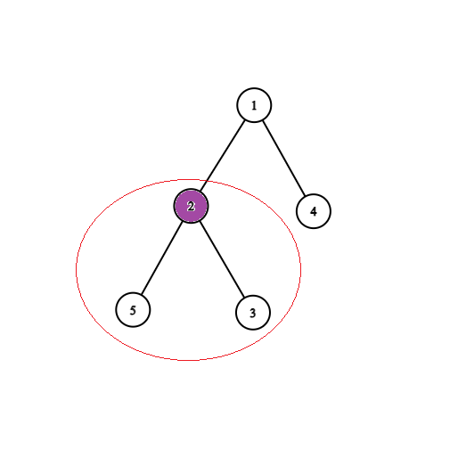

Zanim zacznę omawiać zadanie, przypomnę definicję ocalonego wierzchołka,
ponieważ będziemy z niej często korzystać.
Na końcu dnia wierchołki połączone z jednynką, nie odciętymi krawędziami są ocalone. 
W grupie tych wierzchołków nie może znaleźć się żaden zainfekowany.

Ponieważ zadanie jest całkiem skomplikowane, 
zanim przejdziemy do tego w jaki sposób poruszać się po drzewie 
(czyli docelowego rozwiązania), postaramy się uprościć treść jak tylko możliwe.

### Obserwacja 1

Nigdy nie ocalimy wierzchołka $v$, który należy do poddrzewa pewnego zainfekowanego wierzchołka $u$.

**Dowód:** Jeżeli $v$ byłby ocalony, to byłby połączony z jedynką nie odciętymi krawędziami,
a ponieważ ten graf jest drzewem, to takie połączenie jest dokładnie jedno i przechodzi przez $u$.
Zatem $u$ też byłby połączony z jedynką, co jest niedopuszczalene, bo $u$ jest zainfekowany.
Możemy więc pozbyć się wszystkich poddrzew zainfekowanych wierzchołków, i zostaniemy z drzewem, 
w którym każdy zainfekowany wierzchołek jest liściem (jak na rysunkach poniżej).

{: width="49%" }
{: width="49%" }

### Obserwacja 2

Przyjrzyjmy się teraz liściom, które nie są zainfekowane. 
Niech $v$ będzie zdrowym liściem, a $u$ jego ojcem. Zauważmy, że jeżeli ocalimy $u$,
to bez żadnej straty możemy też ocalić $v$.

**Dowód:** Wystarczy nie ucinać krawędzi $v \leftrightarrow u$, skoro $u$ był ocalony,
to $v$ wtedy też będzie oaclony i nie połączymy w ten sposób żadnego zainfekowanego wierzchołka
z jedynką, bo jedyny wierzchołek jaki dodamy to $v$.

Możemy więc znowu skompresować nasze drzewo. Możemy usunąć wierzchołek $v$ całkowicie i zapisać w wierzchołku
$u$ informację (wagę), że jeżeli go ocalimy, to dodamy do wyniku o jedgen wierzchołek ($v$) więcej. Potem możemy
powtarzać ten zabieg dopóki wszystkie liście nie będą zainfekowane. Poniżej przykład takiego procesu.

{: width="19%" }
{: width="19%" }
{: width="19%" }
{: width="19%" }
{: width="19%" }

Po zastosowaniu tych dwóch kompresji zostaniemy z drzewem o ważonych wierzchołkach, w którym wszytkie liście są zainfekowane oraz
wszystkie pozostałe wierzchołki są zdrowe. Waga wierzchołka w tym drzewie mówi nam ile powinnniśmy dodać do wyniku ocalając dany
wierzchołek. [^1]

[^1]: Przypadek szczególny: Nie ma żadnych zainfekowanych wierzchołków i całe drzewo zostanie skompresowane do jednego wierzchołka, wtedy technicznie jest to nie zainfekowany liść, ale nie będziemy rozważać tej możliwości dalej w rozwiązaniu, bo jest prosta do "wyifowania"

Od teraz mówiąc "wierzchołek" będę miał na myśli niezainfekowany wierzchołek w tym skompresowanym, ważonym drzewie.

### Obserwacja 3

Możemy ocalić wszystkie wierzchołki które odwiedzimy.

**Dowód:** Zaczynamy w jedynce, więc jedynkę zawsze odwiedzimy. Możemy się przemieszczać na 2 sposoby, 
albo przejście wzdłuż krawędzi, albo powrót do jedynki (która jest odwiedzona). Zatem wszystkie odwiedzone wierzchołki
będą połączone ze sobą, a więc również z jedynką. Nie będzie wśród nich żadnych zainfekowanych, a skoro każdy z nich jest
w pewnym momencie odwiedzony, to możemy odciąć wszystkie krawędzie łączące tą grupę z nie odwiedzonymi wierzchołkami.

### Obserwacja 4

Nie możemy ocalić żadnego wierzchołka którego nie odwiedzimy.

**Dowód:** Załóżmy że chcemy ocalić nie odwiedzony wierzchołek $v$ ($v \neq 1$, bo $1$ jest zawsze odwiedzony). 
Ponieważ nigdy go nie odwiedzimy, to w szczególności nigdy nie będziemy też w jego poddrzewie, zatem nigdy nie utniemy
tam żadnych krawędzi. Musielibyśmy więc ocalić całe to poddrzewo. W każdym poddrzewie musi być przynajmniej jeden liść,
a ponieważ każdy liść jest zainfekowany, to musielibyśmy ocalić zainfekowany wierzchołek, sprzeczność.

Czyli sprowadziliśmy tą treść do takiej postaci:
"Dane jest drzewo ukorzenione w 1, ważone na wierzchołkach. Dozwolone są 2 operacje, przejście wzdłuż krawędzi (o koszcie 1)
oraz powrót do korzenia (o koszcie 0). Chcesz odwiedzić wierzchołki o możliwie największej sumie wag, zaczynająć w 1 i wydając
co najwyżej $t$ jednostek czasu." [^2]

[^2]: Pozbyliśmy się zainfekowanych liści z drzewa, ponieważ nie są potrzebne do rozwiązania, wiemy
że ocalimy dokładnie te wierzchołki które odwiedzimy.

Rozwiążemy ten problem programowaniem dynamicznym.

Policzymy tablicę $DP[v][t][stay]$ która będzie nam mówiła jaką maksymalną sumę możemy uzyskać z poddrzewa wierzchołka $v$,
zakładając że zaczynamy w wierzchołku $v$ i mamy do dyspozycji $t$ czasu. $stay$ jest boolem, jeżeli ma wartość $true$, to możemy
"zostać" w tym poddrzewie, czyli nie interesuje nas gdzie się znajdujemy po upływie czasu $t$. W przeciwnym wypadku nie możemy "zostać"
w tym poddrzewie i chcemy po upływie czasu $t$ znaleźć się spowrotem w wierzchołku $v$. Poniżej przykład.

W powyższym grafie $DP[2][7][true] = 13$, ponieważ w 7 jednostek czasu możemy odwiedzić całe poddrzewo 2 w taki sposób:
$2 \rightarrow 5 \rightarrow 6 \rightarrow 5 \rightarrow 7 \Rightarrow 1 \rightarrow 2 \rightarrow 3 \rightarrow 4$, gdzie
pojedyncze strzałki oznaczają przejście krawędzią (koszt 1), a podwójne skok do 1 (koszt 0). Zauważmy, że w tym rozwiązaniu
odwiedziliśmy też jedynkę, ale nie dodajemy jej do wyniku, bo nie należy do poddrzewa 2.
Jeżeli natomiast zmienimy wartość $stay$ na $false$, to $DP[2][7][false] = 12$ i możemy ten wynik osiągnąć w taki sposób:
$2 \rightarrow 5 \rightarrow 6 \rightarrow 5 \rightarrow 7 \Rightarrow 1 \rightarrow 2 \rightarrow 3 \rightarrow 2$.

Jeżeli udałoby nam się policzyć taką tablicę w sensownym czasie, to wynikiem będzie $DP[1][t][true] = DP[1][t][false]$.

Rozważmy najpierw liście. Niech $w[v]$ będzie wagą wierzchołka $v$, a $l$ liściem, wtedy:
$DP[l][t][stay] = w[l]$ niezależnie od $t$ oraz $stay$, ponieważ $DP$ zakłada że zaczynamy w $l$, więc $l$ będzie zawsze
odwiedzony.

Rozważmy treaz wierzchołek $v$ nie będący liściem. Wzór na $DP[v][t][stay]$ nie jest tak prosty do zapisania, więc tylko
wspomnę jak go policzyć. Dla każdego syna $s$ wierzchołka $v$ rozważymy jedną z 3 opcji. 

- Nie wchodzimy do $s$.
- Wchodzimy do $s$ (kosztem 1), spędzamy $t'$ czasu w $s$ i wracamy spowrotem do $s$ (dodajemy do wyniku $DP[s][t'][false]$) 
i wracamy spowrotem do $v$ (kosztem 1). W sumie kosztuje nas to $t' + 2$ czasu, i dodamy do wyniku $DP[s][t'][false]$.
- Wchodzimy do $s$ (kosztem 1), spędzamy $t'$ czasu w $s$ (dodajemy do wyniku $DP[s][t'][true]$) i zostajemy w tym poddrzewie.
W sumie kosztuje nas to $t' + 1$ czasu, i dodamy do wyniku $DP[s][t'][true]$, ale na końcu zostaniemy w poddrzewie $s$.

Sprawdzając wszystkie możliwości podzielenia $t$ na synów $v$, pamiętając o tym że z opcji 3 może skorzystać tylko ostatni syn,
jeżeli liczymy $DP[v][t][true]$, lub żaden jeżeli liczymy $DP[v][t][false]$, otrzymamy poprawne, ale wolne rozwiązanie. Można 
je jednak znacznie przyspieszyć stosując 2 optymalizacje.

### Optymalizacja 1

Zamiast rozważać wszystkie możliwe podziały $t$ na synów $v$, będziemy rozpatrywać tych synów po kolei.
Niech $DP_i[v][t][stay]$ będzie wartością $DP[v][t][stay]$, zakładając możemy wchodzić tylko do $i$ pierwszych synów $v$ (niech $s_i$ będzie $i-tym$ synem $v$). [^3]

[^3]: Celowo nie podałem $i$ jako kolejnego wymiaru $DP$, ponieważ nie chcemy tego fizycznie pamiętać w kodzie ze względu na pamięć. Wartości będziemy trzymać bezpośrednio w $DP[v][t][stay]$, będą się one poprostu zmieniać wraz ze wzrostem $i$.

Dla $i = 0$ wygląda to identycznie jak dla liścia, natomiast dla pozostałych $i$, aby policzyć $DP_i[v][t][stay]$ przeiterujemy się po $t'$,
spróbujemy spędzić $t'$ czasu w pierwszych $i-1$ synach $v$ (co odczytamy za pomocą policzonego wcześniej $DP_{i-1}[v][t][stay]$), a pozostałe $t - t'$ spędzimy
w $i-tym$ synie (co odczytami z policzonego wcześniej $DP[s_i][t][stay]$). [^4]

[^4]: Uwaga: niekoniecznie w tej kolejności. Możemy najpierw pójść do $s_i$, a potem wrócić do poprzednich $i-1$ synów, żeby na końcu zostać w jednym z nich.

Optymalizacja 1 daje nam już złożoność $O(n\cdot t^2)$, ponieważ dla każdego wierzchołka $v$ który nie jest 1 ani pierwszym synem innego wierzchołka 
i każdego $t$ przeiterujemy się po wszystkich $t'$ aby policzyć $DP$ dla ojca $v$.

### Optymalizacja 2

Nie musimy dla każdego wierzchołka sprawdzać wszystkich możliwych $t$. W szczególności niezależnie od struktury drzewa, 
dla $t$ rzędu dwukrotności rozmiaru poddrzewa da się odwiedzić całe drzewo i wrócić spowrotem do wierzchołka startowego.

Przy poprawnej implementacji Optymalizacji 2 złożoność amortyzuje się do $O(n \cdot min(n, t))$.

**Dowód:** [https://ceoi2017.acm.si/files/ceoi2017-solutions-practice.pdf](https://ceoi2017.acm.si/files/ceoi2017-solutions-practice.pdf) -- omówienie zadania Muzeum, na samym dole po "Further optimization".

## Uwagi

- Warto wspomnieć, że przy kompresji drzewa nigdy nie usuwamy wierzchołków które nie są liściami, więc odległości pomiędzy wierzchołkami pozostają równe 1.
